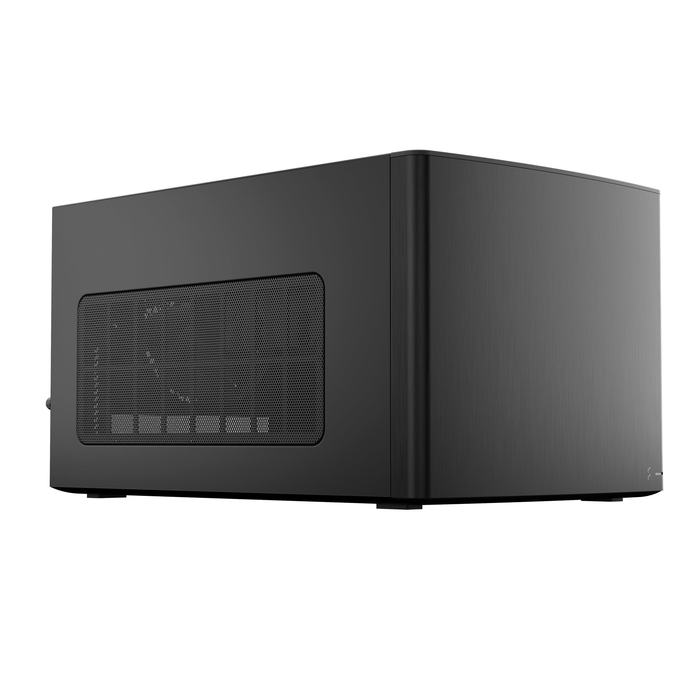
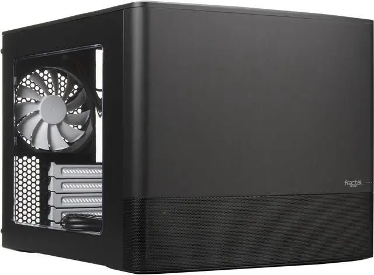
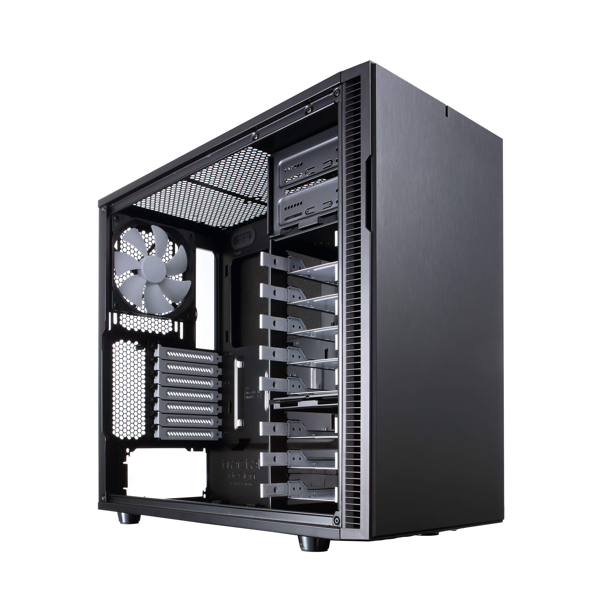
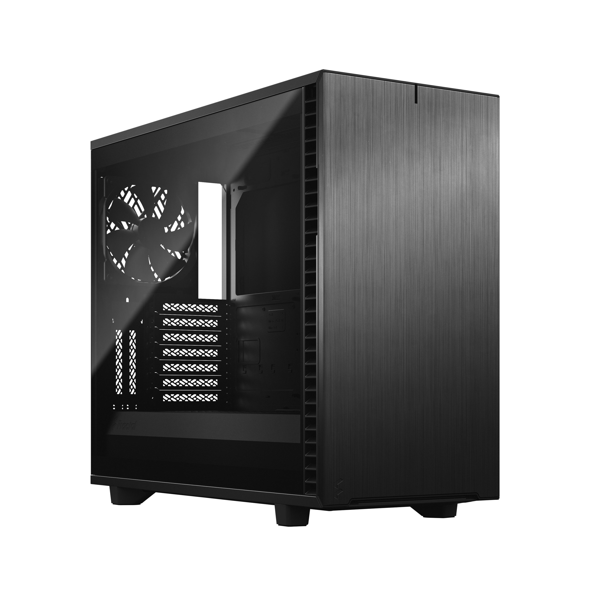
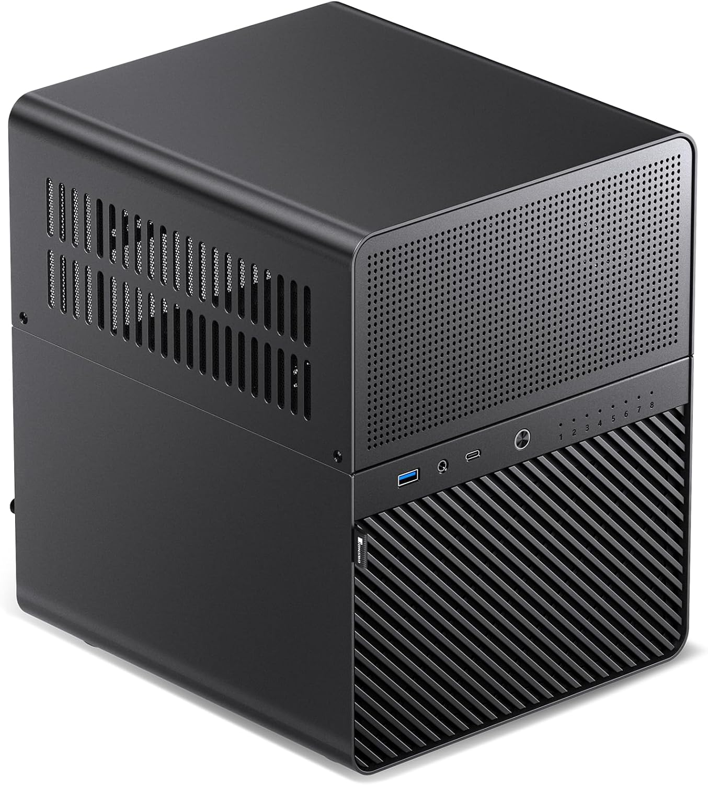
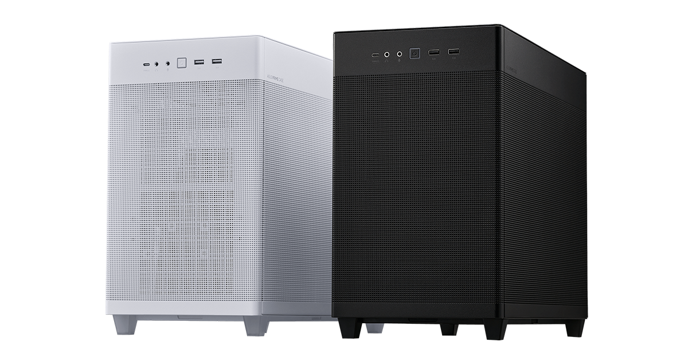

# 🔩 Choosing Hardware?

If I was to build a server again, I'd only be slightly less confused on how to go about it than I was the first time. Here are just some of the stuff I remember.&#x20;

### Hard Drives

There are a few things to consider when purchasing hard drives.

#### CMR vs SMR

CMR and SMR are different ways data cant be written to the drive, and **CMR is better**.  Some people say you can get away with using a SMR drive if you aren't using it as a parity drive, but your call.&#x20;

#### Buying Used HDDs?

Server communities such as [serverbuilds.net](https://www.serverbuilds.net/) actually recommend you to buy used hard drives. And I know I know, you're probably saying "that sounds like the exact opposite of what I should do."&#x20;

Here are the supporting reasons:

1. Hard drives don't have a certain amount of data it can write until it dies (unlike SSDs) so they can run for a long time. A brand new HDD also has a chance of dying right away so it's kind of like a lottery. With the used drives they are at least tested before being sent out (if bought from a reputable place).&#x20;
2. Used drives are significantly cheaper than new drives when you're looking at large storage sizes. Like, saving hundreds of dollars cheaper.&#x20;

The downsides to buying these used hard drives are that they are noisier and vibrate more.&#x20;

1. Noise - How noisy are they? The noise is only really a worry if the server is going to be in the same room where people frequent a lot (e.g. bedroom, living room). With one drive it's a baby hum, but the more drives, the louder the hum. Unraid does have a feature where it turns off the drive if its not in use, however its nosiest when starting up.&#x20;
2. Vibration -  Now these bad boys do get bumping and grinding. You might've read some worrisome posts online about hearing the vibrations in other rooms. They probably have it on something hollow and lightweight like a desk or cabinet, because where else would you put a server unless you already have a server rack or are able to put the server in a laundry room or something.. But rest assured there is a solution that I've found. Put the server on a handful of thick neoprene foam sheets and you're golden. THIS IS FOR PUTTING IT ON A DESK, IDK ABOUT MID TOWER CASES

#### HBA Controllers

These are basically PCIe cards that add extra SATA ports for your drives, as motherboards typically have 4 ports. Drives can also have SAS ports, so there are controllers with multple SAS ports.&#x20;

### SSD

People often put a SSD in their build as a cache drive. For two reasons:&#x20;

1. So the system files can be on the SSD and run faster.&#x20;
2. The files downloaded will go onto the SSD faster and then get moved to the array using Unraid's mover feature.&#x20;

Even though Unraid main features are towards hard drives, you can 100% have an all SSD Build.\
\
When installing the cache drive that you're going to put the system files on, put them in the first M.2 slot. I made the mistake of putting it in the second M.2 slot thinking that they're both the same speed so it shouldn't matter. It DOES matter. The first slot has more stable connection with the CPU. By having the drive in the second slot, my docker was crashing a lot.&#x20;

### CPU

Assuming the server is for regular home lab uses and nothing out of the ordinary, you ideally want a low TDP CPU. Seeing how people use really old parts, the amount of cores and threads isn't a huge concern, just get whatever you can.

**Quick Sync** may be something to look out for when choosing a CPU. It allows for hardware transcoding for media servers , rather than only relying on software which is super slow.&#x20;

### PSU

Same deal as buying a power supply for your PC. Don't be an asshole idiot and grab a cheap unit because it doesn't give performance. You can refer to [this](https://docs.google.com/spreadsheets/d/1akCHL7Vhzk_EhrpIGkz8zTEvYfLDcaSpZRB6Xt6JWkc/edit?gid=1719706335#gid=1719706335)

### Case

Ah yes cases, this is where things can be spicy. There are regular PC cases with a lot of HDD drives, server oriented cases, and some cases with sleds so you can easily swap on drives. Here are some options that I'm aware of.

List of Cases

<table><thead><tr><th width="165.66668701171875"></th><th width="212.36663818359375"></th><th></th></tr></thead><tbody><tr><td>Fractal Node 304</td><td>
<figure><figcaption></figcaption></figure>
</td><td><ul><li>$110 USD</li><li>Mini ITX case </li><li>Holds 6 drives</li><li>Very Compact</li><li>I have this and I personally wished I was able to get the bigger version as my drives be a lil toasty. </li></ul></td></tr><tr><td>Fractal Node 804</td><td>
<figure><figcaption></figcaption></figure>
</td><td><ul><li>$135 USD</li><li>mATX case</li><li>Holds 10 drives</li><li>Bigger version of the ITX with better cooling.</li></ul></td></tr><tr><td>Fractal Define R5</td><td>
<figure><figcaption></figcaption></figure>
</td><td><ul><li>$135ish USD</li><li>Mid Tower Case</li><li>Holds 8 Drives</li><li>Fans directly blow on the drives, but the bottom 3 less so. But it's modular so you can supposedly move the drive cage up. </li><li>Has sound deadening material</li></ul></td></tr><tr><td>Fractal Define R7 </td><td>
<figure><figcaption></figcaption></figure>
</td><td><ul><li>$199 USD</li><li>Mid Tower Case</li><li>Holds 6 drives out of the box but can hold up to 14 by by purchasing additional mounts</li><li>XL version comes with 8 out of the box and holds up to 18 </li><li>Has sound deadening</li></ul></td></tr><tr><td>Jonsbo N Cases (N2 and beyond)</td><td>
<figure><figcaption></figcaption></figure>
</td><td><ul><li>Extremely expensive, starting $200 USD, but discounted 30% on sale</li><li>The N3 (holds 8 drives) seems to be the most popular  </li><li>Objectively the best looking and features hot swappable bays </li><li>They aren't without their flaws. Some models don't have the best airflow. They also have a lot of passive cooling which means noise gets out more. </li></ul>

</td></tr><tr><td>Asus Prime AP201</td><td>
<figure><figcaption></figcaption></figure>
</td><td><ul><li>$90 USD</li><li>mATX case</li><li>Holds 3 Drives</li></ul></td></tr><tr><td>Cooler Master N400</td><td></td><td><ul><li>$76 USD</li><li>Full Tower Case</li><li>Holds 8 Drives</li></ul></td></tr><tr><td></td><td></td><td></td></tr></tbody></table>

### USB

Unraid is run on a USB stick. Some popular USB options mentioned a lot in the Unraid Discord include Transcend Jetflash 780 (high quality stuff), Samsung Bar Plus, and the Cruzer Fit.&#x20;

### What If I want a cheap build to test this server stuff out?

The HP Elitedesk 800 G4 SFF is a great option. It can hold 2 drives, and also has 2 M.2 slots. And the i5 8500 that it sports also has 6 cores.&#x20;

### Buying Used Parts

A lot of the people who know what they're doing get old and used parts for making these kinds of servers. In fact there's a whole community dedicated to this. Link Nas Killer. However eBay is often used for these parts.

link the NAS server people. people typically get used parts plug in serverbuild disc
